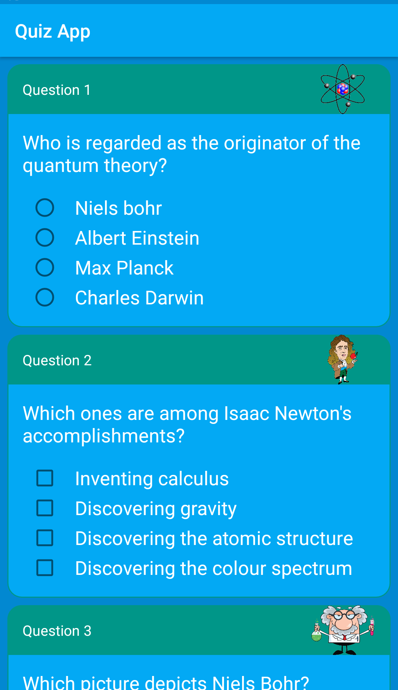

### Quiz App
Take a quiz.  

This app presents the user with five questions on "Famous Scientists". The quiz implements the use of RadioButtons, Checkboxes, EditText views and Buttons
to accept user input. Three of the five questions implement RadioButtons. One question employs the use of Checkboxes and the last employs the use of an EditText view. The user can also use Buttons to interact with the app where applicable.  

The app has been designed with material design principles in mind to provide the user with a pleasing user experience. Appealing colours have been chosen to make it attractive and fun. Whether you are using the app in potrait mode or landscape mode the interface will adjust itself for the best possible natural experience.

### Potrait mode

  

### Landscape mode

  

  

If you don't get all the answers right, worry not. The app will give you an analysis of your performance in the quiz and point out what questions you need to go over again.

### View your results!

  

  

<b>Link to apk on G-drive</b> 
https://drive.google.com/file/d/1QPg_hyXyCzOnExzE5u1aE5V8nPjv5KEM/view?usp=sharing
  

<b>It pays to be inQuizitive!</b>
